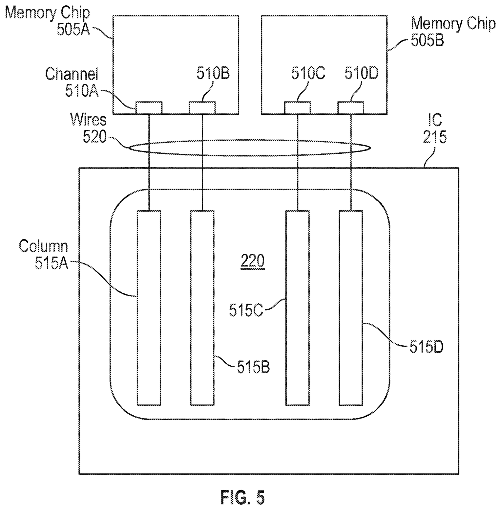

# Etched Filed the Memory Half of Its Story in 2023.

*FIG. 5: the claimed core step as a drawing. Two memory chips (505A, 505B) sit above one IC (215), and each independent channel (510A to 510D) runs over its own wires (520) straight into a dedicated column (515A to 515D) of the chip's systolic array (220) [0044]. No switch, no crossbar, nothing between memory and math. This is the interface the application claims in claim 39 [0016].*

## The Narrative Is Three Years Ahead of the Property Right

The memory half of Etched's architecture story has been in writing since 10 May 2023, in the company's first patent filing, signed by both co-founders. Three years on, that document is still not an asset. It is a pending application, still being argued with a patent examiner, and pledged alongside the rest of the company's patent stack as loan collateral. Meanwhile the philosophy it wrote down is presented on stage as shipping hardware.

The stage version arrived in July 2026, when Etched came out of stealth with an X thread. The company says its first racks ship in summer 2026, that it holds more than $1 billion in customer contracts against $800 million raised, and that its architecture rests on two pillars, Low-Voltage Inference and Cluster-Scale Memory. The memory pillar carries the philosophy: every layer between compute and memory costs latency, so the best layer is no layer. Every number and claim in that thread is the company's own account.

The thread does not cite a patent filing. The filing is still where the checking starts.

## Both Founders Put the Bet in Writing in May 2023

The document is US application 18/195,769, published as US 2024/0378175 A1 under the title "Multi-Chip Systolic Arrays." It was filed on 10 May 2023, which makes it Etched's earliest patent filing. Its two named inventors are Gavin Uberti and Christopher Zhu, the company's two co-founders. The "splittable math arrays" idea the thread describes is this document's subject. So is the memory half that is absent from the company's granted wiring patent, US 12,361,091 B1, the subject of an earlier analysis.

One distinction carries all the weight. A patent application is not a patent. It is the scope a company is asking for, and the claims in it can shrink or die before anything becomes enforceable. So the honest verbs for this document are application-era verbs: Etched is seeking these claims and has been paying to seek them for three years.

What the application asks for, in its broadest form, is a package of chips that behaves as one machine:

> "a package that includes a plurality of integrated circuits (ICs), each comprising a local systolic array of data processing units (DPUs) and chip-to-chip connections configured to connect the local systolic array in each of the plurality of ICs to at least one other local systolic array in another one of the plurality of ICs to form a larger, combined systolic array"
> US 2024/0378175 A1, [0013]

In plain terms, that means many small math grids, on many chips, wired to each other until they act as one big grid. The filing frames this as the way past single-chip limits, a multi-chip approach where local arrays are joined by high-speed chip-to-chip links into one larger, combined array [0019].

## Many Small Arrays, Presented to the Host as One

A systolic array is a grid of small calculating cells, hardware built for algorithms that "perform the same task with different data at different times" [0002]. For transformer-style AI models, the architecture behind today's large language models, the task that dominates the hardware's work is matrix multiplication [0003]. FIG. 1 is the whole mental model. Model weights (110), the numbers a trained model has learned, enter from the top row of cells (105) [0021]. The data being processed, the previous tensor (115), flows in from the left. Every cell multiplies and adds as the streams pass through, so a bigger grid does more math per clock tick.

*FIG. 1: a systolic array, logically. Weights (110) come down from the top [0021], data (115) comes in from the left, and every crossing of the two is a multiply-and-add.*

The problem is that one chip cannot host a big enough grid. The application puts the ceiling plainly: most chips top out at "floating point systolic arrays with a size of 128×128" [0018]. And compute is the smaller half of the problem:

> "it is unreasonable to expect a single chip to interface with 100s of GB of memory used to store parameters and intermediate computation values"
> US 2024/0378175 A1, [0018]

Hundreds of gigabytes is the working size of a modern model's parameters, roughly a whole laptop's storage, and the filing's premise is that no single chip realistically interfaces with that much memory [0018].

The application's answer is composition. Identical chips (215) tile a package (201), each holding its own small array (220). Horizontal connections (230) and vertical connections (225) [0029] join neighboring tiles until they compute as one combined systolic array (250) [0019]. The description offers Universal Chiplet Interconnect Express, UCIe, a chip-to-chip standard, as one way to build those links, with a physical layer that "supports up to 32 GT/s" [0030]. That is a description preference, not something claim 1 requires as drafted. To the machine hosting it, the seams disappear: the combined array "appears to be one large array" [0028]. And the geometry scales in a specific direction, since weight data is reused as it falls down the rows: adding more rows of chips adds compute without adding memory chips at the top [0039].

*FIG. 2: the package (201). ICs 215A to 215I, each carrying an array tile (220), join through horizontal (230) and vertical (225) chip-to-chip connections into Combined Systolic Array 250. Memory chips (210A to 210C) sit only on the top row, and the host computer (205) connects over a standard PCIe link (240).*

One more choice marks how single-minded the machine is meant to be. In the embodiment the filing describes, the combined array "does not take instructions at runtime, and only executes instructions in a preset loop" [0027]. There is no program counter to redirect and no scheduler to negotiate with. That inflexibility is the investor-relevant fact: this is a machine you build when one workload, transformer inference, the running of already-trained models, deserves its own dedicated hardware. And the design commits hardest on the memory side.

## The Application Claims a Memory Interface With No Switch in It

Now the memory half. Start with what the filing itself calls typical. High Bandwidth Memory, HBM, the stacked memory chips AI accelerators use, exposes several independent channels, and a device normally reaches them through an intermediary:

> "a switch (or some kind of switching element such as a crossbar) is typically used so that the device can access the entire memory of the HBM"
> US 2024/0378175 A1, [0043]

The switch buys flexibility. Any part of the chip can reach any region of the memory, and the price is a layer of silicon, with its space and power, sitting between memory and math.

Claim 39 of this application asks for the opposite. In translation, each memory channel is bonded, permanently, to its own column or columns of the array, and nothing can reroute it. The claim language, mirrored almost word for word in the filing's own summary, reads:

> "a separate memory device comprising a plurality of channels where each of the plurality of channels is hardwired to respective one or more columns in the systolic array without any switching element"
> US 2024/0378175 A1, [0016]

The workload is what makes this thinkable. The weights streaming into the top of the array "may be constants" [0021], so a given column always eats the same slice of the model, and a rerouting layer buys nothing. The description spells out that the channels "can be directly wired (or hardwired) to a particular column" [0044], concludes that "hardwiring the memory chips 505 to the columns 515 is permissible" [0045], and books the deletion as a gain, "which can save space and power" [0045]. The bandwidth follows: with several memory chips feeding each top-row chip, the arrangement "can enable the memory chips 305 to transmit more than 1 TB/s of data to each of the ICs" [0040]. One terabyte per second is roughly a full laptop drive's contents moving every second, into each top-row chip.

The claim set builds a family around the idea. Claims 7 and 8 put HBMs on that same switchless hardwiring, with claim 8 asking for several per top-row chip. Claim 15 frames the system version, an AI accelerator whose memory chips, coupled to the ICs forming the top row, store the model's weights [0014]. FIG. 5 is the whole argument in one picture: two boxes of memory, four columns of math, and only wires in between.

When the company says today that each memory layer adds latency and the best layer is no layer, this is that idea's earliest written form: pull the switch out and bond the memory to the columns it feeds. **The 2023 filing books the gain as space and power [0045]. Latency is the word the 2026 thread added.**

## The Rest of the 2023 Design Is Already Transformer-Shaped

A pure matrix engine cannot run a whole transformer, and the filing knows it. One part of a transformer needs memory of the past: "self-attention operations use data computed from previous tokens, which means such data should be saved" [0047]. Self-attention is the step where a model looks back over everything it has generated so far. That step is the exception, though, because "Most of the parts of a transformer AI model do not use data from previous tokens" [0047].

The application splits the silicon along exactly that line. Claims 11 to 13 add auxiliary circuitry (605) beside each array tile, backed by local memory chips (610) that hold the token history. The last of them, claim 13, then draws a boundary the arrays cannot cross:

> "In this embodiment, the local systolic arrays 220 do not have access to the local memory chips 610."
> US 2024/0378175 A1, [0051]

The big arrays stay pure matrix engines. Attention's bookkeeping gets its own circuit and its own private memory, and the two never contend for the same store [0051].

*FIG. 6: division of labor. Each IC (615A to 615D) holds an array tile (220) plus an auxiliary-circuitry block (605). The local memory chips (610A to 610D) are reachable only by that auxiliary circuitry.*

The last piece is keeping the giant array busy. FIG. 7 charts a transformer layer's stages flowing through one row of the array, with a new computation entering before the previous one drains. Even with a stall for layer normalization, a bookkeeping step that rescales values between stages, the filing says the result can still be "98% or greater utilization of the systolic array" [0057].

*FIG. 7: pipelining one array row. Attention queries, keys, and values, projection, and the MLP layers follow each other through the row [0055], and at Time A a new computation has already entered while the previous one drains [0056]. The only idle gap is the layer-normalization stall, marked at Time B [0057].*

Not everything here is that committed. The broad combined-array claims carry no AI limitation, and neither does claim 39's memory interface. That is ordinary drafting breadth. Where the filing does commit, it commits along a transformer's seams: the silicon split at self-attention's boundary, the timing chart pacing one layer through one row. The open question is not what this machine is for. It is what the document describing it is worth.

## Etched Banked the Stack and Keeps Paying to Advance This Filing

So what is this document, as a thing an investor can price, in July 2026? As of the 2026-05 record, Etched is still paying to push this application through examination: it is pending, has drawn one final rejection (the examiner's formal no), and is moving again under a request for continued examination, a paid restart. The filing's family is US-only, with no international filing and no continuation, the follow-on application that would extend the family. That is a narrower footprint than the company's granted patents carry, a contrast to note, not a motive to read.

The money facts sit in the public registry: TriplePoint Capital took a security interest, a lender's collateral claim, in Etched's patent assets effective 19 April 2024, recorded at USPTO reel/frame 067204/0877. That lien covers the four applications then on file, this one and two since-rejected compiler filings among them. A second security interest, effective 18 July 2025, sits at reel/frame 071792/0869 and covers the portfolio as of that date, including the company's three granted patents. The second and third of those grants had issued three days earlier, on 15 July 2025. The dates are registry fact, and reading them as a lender sweeping fresh assets into its collateral is an inference, not a record. Both liens are blanket over the portfolio at signing, with no selectivity about any single filing, so they say nothing about this application in particular. What they do say cuts both ways: the patent stack, crown jewels included, is concrete enough to bank as venture-debt collateral, and the same pledged pool is what a creditor reaches if things go wrong.

The strongest objection to the whole origin-document framing lands here, and it deserves full strength. What is in writing is claim scope Etched has sought and failed to obtain for three years. The examination record lists 8 references, all examiner-cited, clustered in multi-node ML acceleration, hybrid parallelism, and neural-network accelerator architectures, which is to say the field is crowded. The broad combined-array claims, claim 1 and claim 26 as drafted, sit closest to that art and are exactly the kind of claims that shrink in it. Three years of prosecution have produced no enforceable claim at all. If the set narrows or dies, what remains is a disclosure with a date on it, and a disclosure is not a moat.

## A Dated Roadmap the Company Keeps Funding, Not Yet a Fence

Hold the July 2026 thread against the May 2023 filing and the verdict is firm. This document is the origin record of Etched's architecture bet: the memory half of the no-middlemen philosophy in writing, with the transformer-shaped division of labor drawn beside it. Priced today, it is a roadmap in formation rather than a fence. The company is still paying to defend it, has already banked it with the rest of the stack, and does not yet own anything in it.

The crowded-field objection survives contact and changes nothing about the date. Three things stay true however prosecution ends: the filing date stays 10 May 2023, the named inventors stay the two founders, and the content stays the switchless channel-to-column interface, which no rejection can un-write.

Within the sought set, the most specific piece, claim 39's hardwired channels "without any switching element" [0016], inverts the crossbar practice the specification itself calls typical [0043]. That specificity makes it the one built to survive in some form among the application's four independent claims, the ones that stand on their own rather than adding to another. The one guard the evidence forces is just as specific: broad claim 1, the plain combined-array package, sits closest to the examiner-cited multi-node art and is the part of this filing likeliest to shrink or die. The rejection record and the blanket liens scope this call without softening it.

The falsifier is already on the docket. The paid restart has put the claims back in front of the examiner, and that process ends one of two ways. Either claims are allowed, and the memory half starts becoming a property right, or the claims narrow or die, and this document stays what it is today, a dated, co-founder-signed blueprint of the machine Etched is now selling. The philosophy was in writing by May 2023 either way. What the record decides next is whether that writing becomes property. The racks are shipping, the company says. The paper is still asking.

# Sources

## Patents

- US 2024/0378175 A1 (application 18/195,769), "Multi-Chip Systolic Arrays," Etched.ai, Inc., filed 2023-05-10, published 2024-11-14, inventors: Gavin Uberti, Christopher Zhu.
- US 12,361,091 B1, Etched.ai, Inc., granted 2025-07-15 (the "wiring half," subject of the companion analysis).
- USPTO assignment records, TriplePoint Capital LLC security interests: reel/frame 067204/0877 (effective 2024-04-19) and reel/frame 071792/0869 (effective 2025-07-18).
- USPTO Patent Center / DOCDB prosecution record for US application 18/195,769 (WIPS export, 2026-07-02).
- USPTO/Google Patents citation record for US 2024/0378175 A1.

## Official statements

- Etched, stealth-exit announcement thread on X, July 2026.

# Footnotes

[^thread-claims]: All thread content ($1B+ contracts, $800 million raised, summer 2026 rack shipments, the LVI and CSM pillars, and the memory-layer philosophy) is company-claimed and unverified; quote chain is thread → input/essay-context.md → essay per fact-check-log `etched-thread-2026-07`. Every body use carries "the company says" attribution.

[^derived-comparisons]: The laptop-storage comparisons for "100s of GB" and 1 TB/s are the essay's own scale illustrations, not patent text. The three-days-earlier interval is computed from registry dates (fact-check-log `grant-lien-timing`); motive readings are labeled as inference in the body.

[^prosecution-label]: The prosecution status is consumed by exactly one label sentence in the asset-status section, per the run's label-sentence budget (fact-check-log `prosecution-record`, evidence_level registry-extract). No office-action chronology appears in the body.

[^fig-05-crop]: Header asset fig-05.png: at publication the 5:2 header crop should keep both memory chips (505A/505B) and the four column entries (515A to 515D) in frame, centered on the channel/wire band (per figure-selection.md cover note).

[^figure-assets]: Cleaned figure assets for upload: figures/fig-05.png (header), fig-01.png, fig-02.png, fig-06.png, fig-07.png.

[^figures-not-placed]: Selected-set audit: placed figures are fig-05 (header), fig-01, fig-02, fig-06, and fig-07, matching figure-selection.md. Phase 1 intentionally dropped fig-03 and fig-04 (sizing-variant family of FIG. 2); their one load-bearing point, more compute rows without more memory chips, travels in prose via [0039]. Neither appears in the body.
