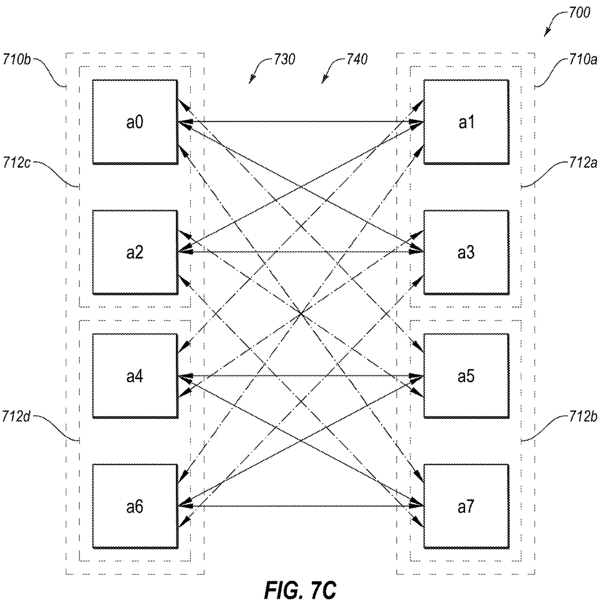

# Etched Patented the Wiring Half of Its Memory Story, Not the Memory

*FIG. 7C: the claimed core in one drawing. Eight chips stand in two columns: the first set 710a (a1, a3, a5, a7) on the right and the second set 710b (a0, a2, a4, a6) on the left [0126]. Every chip in one column is wired straight to every chip in the other, 16 channels in all, counted off the drawing, and no wire runs inside a column [0128], [0129]. Both channel families (730, 740) are overlaid here [0125].*

## The Memory Story Has a Checkable Half

In early July 2026, Etched came out of stealth with an X thread announcing an inference-specialized AI chip. Half of the loudest architecture claim in the thread already has a granted US patent standing behind it. The other half, the shared memory pool that gives Cluster-Scale Memory its name, has no granted substance in the filings you can read today. That split is the story, and the claims make it checkable.

The thread's claims are specific, and every number in them is the company's own account. Out of stealth after finishing its first chip design, the A0. First racks built, shipping in summer 2026. More than $1 billion in customer contracts against $800 million raised.

The architecture case rests on two pillars. Low-Voltage Inference is the power pillar. Cluster-Scale Memory, or CSM, is the one that pulled readers in: a "shared low-latency memory pool across the entire scale-up domain" running over a "proprietary ultra-low-latency, high-bandwidth interconnect". The slogan attached is the thread's cleanest line: "each memory layer inherently adds latency; thus, the best layer is no layer".

Twelve months before the thread, in July 2025, the US patent office granted Etched a patent titled "Tensor parallel group". Its claims lock a wiring discipline for a group of chips: two sets, every cross-set pair directly wired, nothing wired inside a set [0386]. Any chip can reach any other through at most one chip in between [0387]. None of its claims mention latency, a bandwidth magnitude, or memory.

## A Structure Patent Etched Keeps Paying to Extend

The document to check is US 12,361,091 B1, "Tensor parallel group", filed 22 October 2024 and granted 15 July 2025, inside nine months. Gavin Uberti, Etched's co-founder and chief executive, is the sole named inventor. It carries 23 claims, three of them independent, across 16 figures, and every claim pursues one idea: how the chips of a cluster should be wired to each other.

It did not file alone. The same day, the same inventor filed two more. US 12,306,903 B1, granted in May 2025, covers how tensor tiles move between chips. US 12,361,262 B1, granted the same July day as this one, covers the model-level execution those moves add up to.

The division of labor is visible inside this patent's own text. The specification enumerates three example families, methods, topology, and AI-model computation [0336], [0337], [0384], [0418], and the claims granted here track only the topology family. Etched is paying to keep all three alive: a PCT filing extends each abroad, and a US continuation, published in 2026, keeps each open at home. This one's expected term runs to October 2044. That is the filing pattern of a company fencing an architecture, not filing a one-off.

## Every Chip Reaches Every Chip Without a Switch

The patent starts from the size problem. Tensors, the grids of numbers AI models multiply, can be "large enough that processing of the tensors in a typical manner using a single processor may be difficult" [0021]. So the work is split across a group of chips, and the split creates the real problem. Mid-computation, the chips must combine partial results into one (a reduction) and hand out copies of pieces (a gather) to keep going [0036], [0037], [0039]. Each chip here is a processing device in the patent's vocabulary, built as a systolic array, a grid of small processing elements that computes as data flows through it (FIG. 1).

*FIG. 1: inside one tensor parallel group: processing devices built as systolic arrays.*

Hardware has two standard answers for that exchange, and the patent names both as foils. Route everything through a networking switch that lets any chip talk to any chip [0032], a data switch the filing calls "expensive to include in a system that performs tensor operations" [0026]. Or wire every chip to every other chip, a point-to-point scheme whose connection count balloons as the group grows [0130]. Any-to-any reach normally costs a switch or a wire per pair. Claim 1 is built to deliver the reach with neither.

The construction is simple to say. Split the group's chips into two sets, four or more a side under the granted claim. Wire every chip in one set directly to every chip in the other. Run no wire inside a set. In the drawings' eight-chip example, the odd-numbered chips form the first set (710a) and the even-numbered chips the second (710b) [0126]. Claim 1 fixes the whole of it in one limitation:

> "a plurality of communication channels to directly communicatively couple every processing device in the first set of the plurality of processing devices with every processing device in the second set of the plurality of processing devices without communicatively coupling any of the plurality of processing devices in the same set of the plurality of processing devices"
> US 12,361,091 B1, claim 1, [0386]

(In graph-theory terms, this is a complete bipartite graph, K4,4 in the eight-chip case.)

What the missing wires cost is one hop. Chips in the same set have no direct channel between them [0128], so a message between two set-mates rides through one chip of the opposite set: two hops, one intermediate device, never more [0130]. Claim 1 makes that bound a requirement, wiring the group so every chip can communicate with any other "through at most one other of the plurality of processing devices" [0387]. The relay need not even hold the message, since an intermediate chip may begin forwarding data before it has finished receiving it [0143]. The wire count stays modest. The eight-chip drawing gets by with 16 channels, where wiring all pairs directly would take 28 (both counts read off the figure, not numbers the patent states). The stated payoff is the point of the whole shape: the fixed topology "may be used to reduce data sharing between the processing devices A0-A7 and thereby help to reduce a processing time" [0124].

## The Wiring Schedules the Traffic

There is a second layer of order in the web, and it is where the shape stops being textbook. Each set subdivides into two groups of chips, labeled 712a through 712d [0135], [0136], and the channels split with them into two families [0138], [0139]. The first communication channels (730) pair the groups straight across, 712a with 712c and 712b with 712d [0138]. The second communication channels (740) run the criss-cross: 712a with 712d, 712b with 712c [0139].

FIG. 7A and FIG. 7B draw one family each, separated purely for legibility [0123], and the dense web of FIG. 7C is the two overlaid [0125].

*FIG. 7A: the first channel family (730): group 712a wired to every chip of 712c, and 712b to every chip of 712d [0138].*

*FIG. 7B: the second channel family (740): the criss-cross, 712a to 712d and 712b to 712c [0139]. Added to FIG. 7A's links it gives the full FIG. 7C web [0123], [0125].*

The families exist so two kinds of traffic never share a wire. A tensor operation across the group breaks into sub-operations, and claim 8 binds the data transfer for each sub-operation exclusively to one channel subset. Claim 11 names the pair, a reduction and a gather. Which physical family carries which is the description's worked example rather than a claim requirement, with gather traffic on the first channels and reduction traffic on the second [0140]. The exclusivity itself, though, is strict:

> "During the second operation, data may only be transmitted between the processing devices A0-A7 using the second communication channels 740 and not the first communication channels 730 ."
> US 12,361,091 B1, [0140]

Disjoint lanes make simultaneity cheap. Claim 9 has the two sub-operations running in overlapping time periods, one channel family carrying each [0142]. Reduce and gather stop taking turns.

Balance is the other bought property. The tensors are pre-cut so that during these group-wide moves "the same amount of data may be shared by each of the processing devices A0-A7", and the same amount crosses each channel [0168], [0178]. Uniformity is claimed as structure too: each device couples to the same number of chips, the same number of channels, and channels of the same bandwidth (claims 3 to 5). The description works the optimum once: for eight chips, p and q, the two factors that set how many chips share a tensor, come out to about 4.35 and about 1.84 [0061]. Rounded to divisors, that is 4 and 2, and the practical reading is that the whole input matrix lives spread across four of the eight chips [0061]. No link runs hot. The equal channels are wired in, and the equal traffic follows from the split the description prescribes [0168].

## The Description Aims It at Transformer Decoding

None of this is claimed for AI. The claims' only workload hooks are the systolic array (claim 7), matrix multiplication (claims 10 and 23), and the reduction and gather sub-operations (claims 11 and 23). AI, transformers, and inference are absent from the claim language. The intent lives one level down, in the description, and there it is explicit: the AI model of FIG. 9A "may be representative of a large language model or a transformer decoder" [0251]. Its decoding layers, the loop that infers one token at a time [0259], run normalization, then self-attention (QKV generation and attention computation, the making and use of the query, key, and value matrices), then projection, then an MLP [0252], [0254]. From there the work hands off to decoding, the token pick [0259].

*FIG. 9A: the decoding-layer loop the description maps onto the group [0252], [0259].*

The wiring's pressure point is the MLP, the multi-layer perceptron block that follows attention. In a transformer, the description notes, the number of elements in a next-token computation ordinarily tracks the model's depth, but "during the feedforward operation, the number of elements involved in a specific computation may be four times the depth of the transformer model" [0313]. MLP calculations can run four times greater than the model's other computations [0258], which inflates processing time, or the bandwidth needed to hold processing time flat [0313]. The description offers exactly that operation as a basis for sizing the tensor parallel group [0121].

The tensors themselves never assemble in one place. That is the standing rule for the decoding layers:

> "the tensors used during the decoding layers 905 may remain split and distributed among the processing devices such that no one processing device may include the entirety of a tensor during the tensor operations performed by the decoding layers 905 ."
> US 12,361,091 B1, [0278]

Self-attention obeys the same discipline: the Q, K, and V matrices are processed as tiles, on different chips, "without rejoining the tiles of the self-attention tensors Q, K, and V on a single processing device" [0267]. This is the closest the filing comes to the thread's memory idea. A tensor that lives spread across the group, with balanced channels moving only the pieces that must move, is the group behaving like one large store. The patent claims the wiring and the lane schedule that make such behavior cheap. It does not claim the store.

## No Latency Number, No Memory Claim

The objection an informed reader should press lands at full strength. Claim 1 recites a wiring pattern and nothing else. The description says the channels realizing it can be PCIe, SPI, ethernet, UCIe, or other wired or optical links [0134], the ordinary buses commodity hardware already uses, and the chips can sit on separate dies [0133]. No granted claim recites a latency figure or a bandwidth magnitude, and claim 5 requires equal bandwidth across channels, not high bandwidth. The patent's own stated wins are fewer connections than a full mesh [0130] and less data sharing in less processing time [0124], a cost and bandwidth accounting, while the thread's load-bearing adjective is latency. A topology-only claim over standard link technologies is a thin moat for a "proprietary ultra-low-latency, high-bandwidth interconnect".

In practice the fence reaches builders who copy the claimed wiring, and through claim 18 it reaches builders who add links but keep the lane discipline. A rack that keeps its networking switch in place of the claimed direct channels sits outside claim 1: the switch is the foil the filing itself sets against the fixed topology [0026], [0032]. A rack that copies the pattern but adds links inside a set arguably steps outside claims 1 and 14 as written. Both require channels that couple the sets "without communicatively coupling any of the plurality of processing devices in the same set" [0386]. That leaves claim 18, which tolerates the added links and binds the traffic instead, the same kind of rule claims 8, 9, and 11 stack on top of claim 1's structure. Declining that rule is a firmware choice with a price: reroute the traffic and you forfeit the cheap overlap of reduce and gather, the property that made the pattern worth copying.

**Structure is what an apparatus claim can lock, and structure is exactly what this one locks.**

The granted fence is not the adjective. It is the discipline underneath it: cross-set-only direct channels [0386], degree- and bandwidth-uniform links (claims 3 to 5), and reduce and gather running simultaneously on disjoint channel families (claims 8, 9, 11). That last element is the non-generic, inference-shaped part, and the whole fence is the wiring discipline the patent's own cluster-scale arithmetic runs on [0168], [0061]. The thread's adjective was never claimable as such. A hop bound is, and claim 1 sets one: at most one device between any two chips, ever [0387].

In the description, memory is scenery. FIG. 6 shows a host, two tensor parallel groups, and a memory 630 [0112] whose role is to "provide tensors and other data to the tensor parallel groups 620 for processing" [0119]. The description also lets each chip couple to memory devices, shared among the chips or not, and no claim picks that option up [0133].

*FIG. 6: box 630, the memory that feeds the tensor parallel groups, described in one embodiment figure and never claimed [0119].*

The granted claims are also narrower than the description's framing. The specification's summary covers two sets of "two or more" devices [0385], while granted claims 1 and 14 require four or more per set. The third independent, claim 18, keeps the two-or-more floor but pays for it in structure: each set must contain two device groups, wired in at least the dual-family pattern of FIGS. 7A and 7B, with each sub-operation's traffic confined to its own family. Three independents, three different trades of breadth for structure, and none of them mentions memory.

The thread's other pillar has no fence here either, and this is the one caution the verdict carries. Low-Voltage Inference is nowhere in this filing. The same goes for the power-delivery work, the cold plates, and the HBM/SRAM hybrid (stacked high-bandwidth memory paired with on-chip SRAM) that the thread folds into CSM.

The company says its math blocks run at under half the voltage of typical AI chips, and nothing granted and public today carries a claim on that. US applications can stay unpublished for up to 18 months after filing, so the visible record is a floor, not a census. Later filings may yet cover LVI. Nothing readable today does.

## One Leg Substantiated, One Leg Absent

Hold the thread against the grant and the verdict is firm both ways. The interconnect leg of Cluster-Scale Memory has granted, checkable substance: a group wired so every chip reaches every other chip through at most one intermediate device [0387]. Reduce and gather traffic run at the same time on separate channel families [0142], over equal-bandwidth links (claim 5), with the same load on every link under the description's prescribed split [0168]. The whole arrangement exists to cut data sharing and processing time [0124]. The memory-pool leg has no substance in this filing, and Low-Voltage Inference is untouched by it. The boundaries set out above scope that call. They do not soften it.

The claims cannot say what Etched actually built. The racks can. The company says its first systems ship in summer 2026. When they do, the scale-up domain becomes inspectable: the wiring either matches claim 1's cross-set pattern [0386] or it does not. Etched has, in effect, published the diagram its own hardware can now be checked against.

The thread sells a memory story. The granted record holds a wiring story. The wiring half is the one you can check today, and it holds.

# Sources

## Patents

- US 12,361,091 B1, "Tensor parallel group," Etched.ai Inc., priority 2024-10-22, published 2025-07-15, inventors: Gavin Uberti.
- US 12,306,903 B1, "Performance of tensor operations," Etched.ai Inc., priority 2024-10-22, published 2025-05-20, inventors: Gavin Uberti.
- US 12,361,262 B1, "Tensor operations in AI models," Etched.ai Inc., priority 2024-10-22, published 2025-07-15, inventors: Gavin Uberti.

## Official statements

- Etched, stealth-exit announcement thread on X, July 2026.

# Footnotes

[^quote-chain]: Thread quotations ("shared low-latency memory pool across the entire scale-up domain", "proprietary ultra-low-latency, high-bandwidth interconnect", "each memory layer inherently adds latency; thus, the best layer is no layer") are transcribed via input/essay-context.md; quote chain is thread → essay-context → essay per fact-check-log `etched-csm-thread-2026-07`.

[^derived-counts]: The 16-versus-28 channel comparison is arithmetic read off fig-07C and stated as such in the body; it is not patent text. The "inside nine months" examination period is computed from the filing and grant dates: 266 days.

[^fig-07c-crop]: Header asset fig-07C.png is roughly square; at publication the 5:2 header crop should center on the mid-band where the 730/740 families interleave, keeping both column groups (710a/710b) in frame (per figure-selection.md).

[^figure-assets]: Cleaned figure assets for upload: figures/fig-07C.png (header), fig-01.png, fig-07A.png, fig-07B.png, fig-09A.png, fig-06.png.

[^figures-not-placed]: Selected-set audit: placed figures are fig-07C (header), fig-01, fig-07A, fig-07B, fig-09A, and fig-06, matching figure-selection.md. Phase 1 reviewed and excluded the method-flowchart family (fig-03/04/05, fig-08, fig-10/11/12), the tile-split diagram fig-02, the computer-system boilerplate fig-13, and fig-09B, the equation-level restatement whose pair-break is intentional. None of the excluded figures appears in the body.
